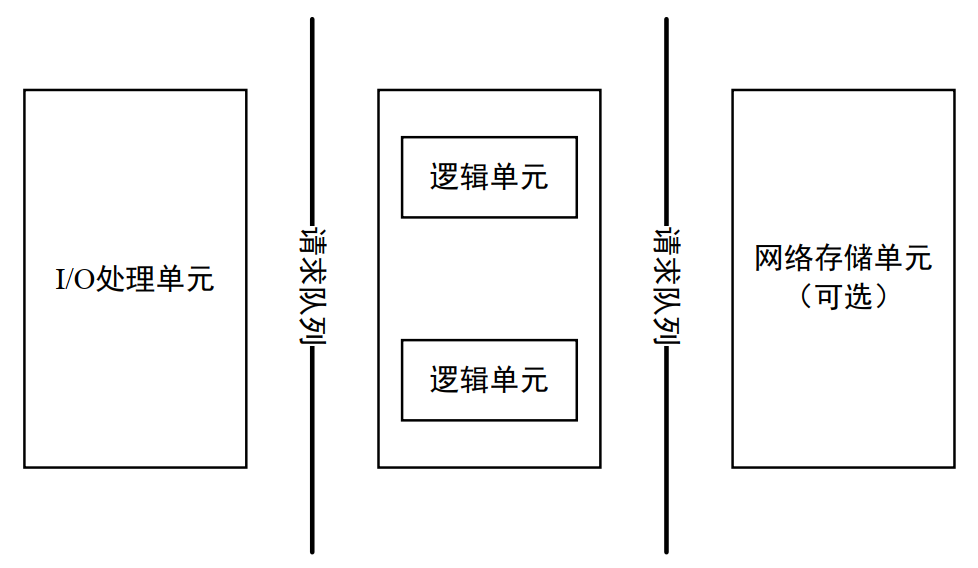

## 第8章 高性能服务器程序框架

**服务器模型**
1. C/S模型：C/S模型的逻辑很简单。服务器启动后，首先创建一个（或多个）监听socket，并调用bind函数将其绑定到服务器感兴趣的端口上，然后调用listen函数等待客户连接。服务器稳定运行之后，客户端就可以调用connect函数向服务器发起连接。由于客户连接请求是随即到达的异步事件，服务器需要使用某种I/O模型来监听这一事件，比如select系统调用。当监听到连接请求后，服务器就调用accept函数接受它，并分配一个逻辑单元为新的连接服务。逻辑单元可以是新创建的子进程、子线程或者其他。逻辑单元读取客户请求，处理该请求，然后将处理结果返回给客户端。服务器在处理一个客户请求的同时还会继续监听其他客户请求。C/S模型有一个缺点：服务器是通信的中心，当访问量过大时，可能所有客户都将得到很慢的响应。
2. P2P模型：P2P模型比C/S模型更符合网络通信的实际情况。它摈弃了以服务器为中心的格局，让网络上所有主机重新回归对等的地位。但它的缺点也很明显：当用户之间传输的请求过多时，网络的负载将加重。实际使用的P2P模型通常带有一个专门的发现服务器，这个发现服务器通常还提供查找服务甚至内容服务，使每个客户都能尽快地找到自己需要的资源。
3. P2P模型可以看作C/S模型的扩展：每台主机既是客户端，又是服务器。因此之后仍然采用C/S模型来讨论网络编程。

**服务器编程框架**

虽然服务器程序种类繁多，但其基本框架都一样，不同之处在于逻辑处理。本章讨论的是基本框架。

对于单个服务器程序来说，I/O处理单元指处理客户连接，读写网络数据；逻辑单元指业务进程或线程；网络存储单元指本地数据库、文件或缓存；请求队列指各单元之间的通信方式。  
对于服务器机群来说，I/O处理单元指接入服务器，实现负载均衡；逻辑单元指逻辑服务器；网络存储单元指数据库服务器；请求队列指各服务器之间的永久TCP连接。

**I/O模型**

socket在创建的时候默认是阻塞的。我们可以给socket系统调用的第2个参数传递SOCK\_NONBLOCK标志，或者通过fcntl系统调用的F\_SETFL命令，将其设置为非阻塞的。阻塞和非阻塞的概念能应用于所有文件描述符，而不仅仅是socket。我们称阻塞的文件描述符为阻塞I/O，称非阻塞的文件描述符为非阻塞I/O。

针对阻塞I/O执行的系统调用可能因为无法立即完成而被操作系统挂起，直到等待的事件发生为止。针对非阻塞I/O执行的系统调用则总是立即返回，而不管事件是否已经发生。如果事件没有立即发生，这些系统调用就返回-1，和出错的情况一样。

很显然，我们只有在事件已经发生的情况下操作非阻塞I/O，才能提高程序的效率。因此，非阻塞I/O通常要和其他I/O通知机制一起使用，比如I/O复用和SIGIO信号。

从理论上说，阻塞I/O、I/O复用和信号驱动I/O都是同步I/O模型。因为在这三种I/O模型中，I/O的读写操作，都是在I/O事件发生之后，由应用程序来完成的。而POSIX规范所定义的异步I/O模型则不同。对异步I/O而言，用户可以直接对I/O执行读写操作，这些操作告诉内核用户读写缓冲区的位置，以及I/O操作完成之后内核通知应用程序的方式。异步I/O的读写操作总是立即返回，而不论I/O是否是阻塞的，因为真正的读写操作已经由内核接管。也就是说，同步I/O模型要求用户代码自行执行I/O操作（将数据从内核缓冲区读入用户缓冲区，或将数据从用户缓冲区写入内核缓冲区），而异步I/O机制则由内核来执行I/O操作（数据在内核缓冲区和用户缓冲区之间的移动是由内核在“后台”完成的）。你可以这样认为，同步I/O向应用程序通知的是I/O就绪事件，而异步I/O向应用程序通知的是I/O完成事件。

**两种高效的事件处理模式**

Reactor和Proactor  
同步I/O模型通常用于实现Reactor模式，异步I/O模型则用于实现Proactor模式。同步I/O也可以模拟出Proactor模式。

Reactor是这样一种模式，它要求主线程（I/O处理单元）只负责监听文件描述上是否有事件发生，有的话就立即将该事件通知工作线程（逻辑单元）。除此之外，主线程不做任何其他实质性的工作。读写数据、接受新的连接、以及处理客户请求均在工作线程中完成。

Proactor模式将所有I/O操作都交给主线程和内核来处理，工作线程仅仅负责业务逻辑。因此，Proactor模式更符合pic1所描述的服务器编程框架。

使用同步I/O方式模拟出Proactor模式的原理是：主线程执行数据读写操作，读写完成之后，主线程向工作线程通知这一“完成事件”。那么从工作线程的角度来看，它们就直接获得了数据读写的结果，接下来要做的只是对读写的结果进行逻辑处理。

**两种高效的并发模式**

并发编程的目的是让程序“同时”执行多个任务。如果程序是计算密集型的，并发编程并没有优势，反而由于任务的切换使效率降低。但如果程序是I/O密集型的，比如经常读写文件，访问数据库等，则情况就不同了。由于I/O操作的速度远没有CPU的计算速度快，所以让程序阻塞于I/O操作将浪费大量的CPU时间。如果程序有多个执行线程，则当前被I/O操作所阻塞的执行线程可主动放弃CPU（或由操作系统来调度），并将执行权转移到其他线程。

并发模式是指I/O处理单元和多个逻辑单元之间协调完成任务的方法。服务器主要有两个并发编程模式：半同步/半异步（half-sync/half-async）模式和领导者/追随者（Leader/Followers）模式。

半同步/半异步模式：这里的同步/异步和之前I/O模型中的“同步”和“异步”是完全不同的概念。在I/O模型中，“同步”和“异步”区分的是内核向应用程序通知的是何种I/O事件，以及该由谁来完成I/O读写。在并发模式中，“同步”指的是程序完全按照代码序列的顺序执行；“异步”指的是程序的执行需要由系统事件来驱动。常见的系统事件包括中断、信号等。  
异步线程的执行效率高，实时性强，但编写以异步方式执行的程序相对复杂，难于调试和扩展，而且不适合大量的并发。同步线程虽然效率相对较低，但逻辑简单。对于像服务器这种既要求较好的实时性又要求能同时处理多个客户请求的应用程序，就应该同时使用同步线程和异步线程来实现。  
半同步/半异步模式中，同步线程用于处理客户逻辑，相当于逻辑单元；异步线程用于处理I/O事件，相当于I/O处理单元。

领导者/追随者模式：多个工作线程轮流获得事件源集合，轮流监听、分发并处理事件的一种模式。在任意时间点，程序都仅有一个领导者线程，它负责监听I/O事件。而其他线程则都是追随者，它们休眠在线程池中等待成为新的领导者。当前的领导者如果检测到I/O事件，首先要从线程池中推选出新的领导者线程，然后处理I/O事件。此时，新的领导者等待新的I/O事件，而原来的领导者则处理I/O事件，二者实现了并发。  
由于领导者线程自己监听I/O事件并处理客户请求，因而领导者/追随者模式不需要在线程之间传递任何额外的数据，也无须像半同步/半反应堆模式那样在线程之间同步对请求队列的访问。但领导者/追随者的一个明显缺点是仅支持一个事件源集合，无法让每个工作线程独立地管理多个客户连接。

**有限状态机**

有的应用层协议头部包含数据包类型字段，每种类型可以映射为逻辑单元的一种执行状态，服务器可以根据它来编写相应的处理逻辑。

**提高服务器性能的其他建议**

1. 池：既然服务器的硬件资源“充裕”，那么提高服务器性能的一个很直接的方法就是以空间换时间，即“浪费”服务器的硬件资源，以换取其运行效率。这就是池的概念。直接从池中取得所需资源比动态分配资源的速度要快得多，因为分配系统资源的系统调用都是很耗时的。当服务器处理完一个客户连接后，可以把相关的资源放回池中，无须执行系统调用来释放资源。
2. 数据复制：高性能服务器应该避免不必要的数据复制，尤其是当数据复制发生在用户代码和内核之间的时候。如果内核可以直接处理从socket或者文件读入的数据，则应用程序就没必要将这些数据从内核缓冲区复制到应用程序缓冲区中。此外，用户代码内部的数据复制也是应该避免的。当两个工作进程之间要传递大量的数据时，我们就应该考虑使用共享内存来在它们之间直接共享这些数据，而不是使用管道或者消息队列来传递。
3. 上下文切换和锁：并发程序必须考虑上下文切换的问题，即进程切换或线程切换导致的系统开销。即使是I/O密集型的服务器，也不应该使用过多的工作线程，否则线程间的切换将占用大量的CPU时间，服务器真正用于处理业务逻辑的CPU时间的比重就显得不足了。并发程序需要考虑的另外一个问题是共享资源的加锁保护。锁通常被认为是导致服务器效率低下的一个因素，因为由它引入的代码不仅不处理任何业务逻辑，而且需要访问内核资源。因此，服务器如果有更好的解决方案，就应该避免使用锁。